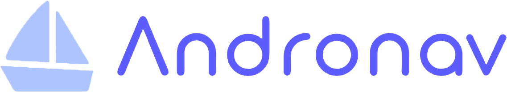

# Projet android

- [Projet android](#projet-android)
- [L'équipe Andronav](#léquipe-andronav)
- [Nos outils](#nos-outils)
- [Définition du projet](#définition-du-projet)
- [Répertoire du projet](#répertoire-du-projet)
  - [AndroNav mobile](#andronav-mobile)
  - [AndroNav api](#andronav-api)
- [Les technologies utilisées](#les-technologies-utilisées)
  - [Andronav mobile](#andronav-mobile)
  - [Andronav api](#andronav-api)
  - [NMEA Simulator](#nmea-simulator)
- [Andronav](#andronav)
    - [Les vues](#les-vues)
        - [Vue 0 - Homepage](#vue-0---homepage)
        - [Vue 1 - Map](#vue-1---map)
        - [Vue 2 - Accéléromètre](#vue-2---accelerometre)
        - [Vue 3 - Map](#vue-3---edition)
- [Brainstorming d'idées non MVP](#brainstorming-didées-non-mvp)
- [Code of conduct](#code-of-conduct)

# L'équipe Andronav

....

# Présentation du projet

## Nos outils

Pour travailler efficacement en équipe de la gestion du versioning à notre outil de sprint, nous utilisons plusieurs outils en ligne :

- [Jira](https://dev-mobile-2023.atlassian.net/jira/software/projects/PDMD/boards/1)
- [Git](https://git-scm.com/)
- [Discord](https://discord.com/)

## Définition du projet

Le but du projet est de construire une application mobile (android) permettant de visualiser le trajet de son drone ( Bateau )

L'application permet de visualer  le dernier trajet renseigner au drone, avec les informations sur la vitesse

Elle nous permet aussi de le controller grace à l'accélérometre du smartphone, deux boutons sont disponible un "HOME" et "URGENCE" qui permettent respectivement de revenir au point de départ de l'itinéraire ( dans un premier temps inverser le trajet effectuer) et d'emettre sur la fréquence d'urgence un signal SOS 

Elle a un mode edition qui permet de définir un itinéraire pour le drone simplement en ajoutant des points sur la carte.
Chaques point du avoir une vitesse défini.

## Répertoire du projet

#### Andronav mobile

- [AndroNav](https://github.com/andronavlabs/andronav)

#### Andronav api

- [AndroNav API](https://github.com/andronavlabs/andronav-api)

## Les technologies utilisées
#### Andronav mobile

- [Kotlin](https://kotlinlang.org/)
- [Android Studio](https://developer.android.com/studio)
- [Android](https://www.android.com/)

#### Andronav

- [Python](https://www.python.org/)

#### NMEA Simulator

- [NMEA Simulator](https://github.com/panaaj/nmeasimulator/releases/tag/v1.4.2)

# Andronav
### Les vues

#### Vue 0 - Homepage

Dans la première vue l'utilisateur rentre les informations de sont drones:
- Son identité ( servira pour la trame AIVDO et AIVDM )( enregistré en local )
Sinon il peut simplement démarrer sont drone

#### Vue 1 - Map

Dans cette première vue l'utilisateur peut visualiser l'itinéraire chargé dans le drone ( le précédent) ainsi que les informations de la vitesse. 

#### Vue 2 - Accéléromètre

L'utilisateur controle son bateau avec l'accéléromètre ( Nord/Sud ) (Ouest/Est)
Une trace de son trajet est visible sur la carte.

#### Vue 3 - Edition

L'utilisateur peut éditer son itinéraire en ajoutant des points sur la carte.
Pour chaque point il pourra définir une vitesse depuis une modal. En cliquant sur le point il pourra modifier la vitesse ou la supprimer. 

Un bouton enregistrer en bas de la carte permettra de sauvegarder l'itinéraire et de lancer 

# Andronav api

L'api doit permettre de gérer les données entre le drone et le simulateur NMEA.

Elle doit permettre au développeur de communiquer facilement avec des données non pas sous la norme NMEA mais sous un format JSON. 

### Brainstroming idées non MVP

####  Idée ajout dans la vue 0

Pouvoir séléctionner la representation du drone sur le menu ( Bateau, voilier, pacquebot )

#### Idée ajout dans la vue 1 

Ajouter une timeline  vertical sur la gauche pour pouvoir scroll les timestamps et ainsi pouvoir voir les informations de la vitesse.
( si possible ajouter sur le trajet une icone de bateau ) 

## Code of conduct

- [Code of conduct](./CODE_OF_CONDUCT.md)
